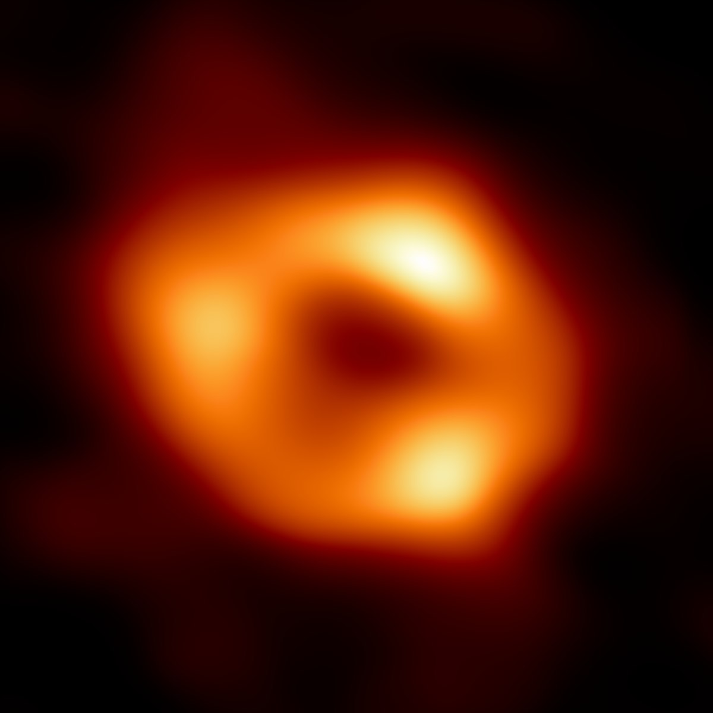
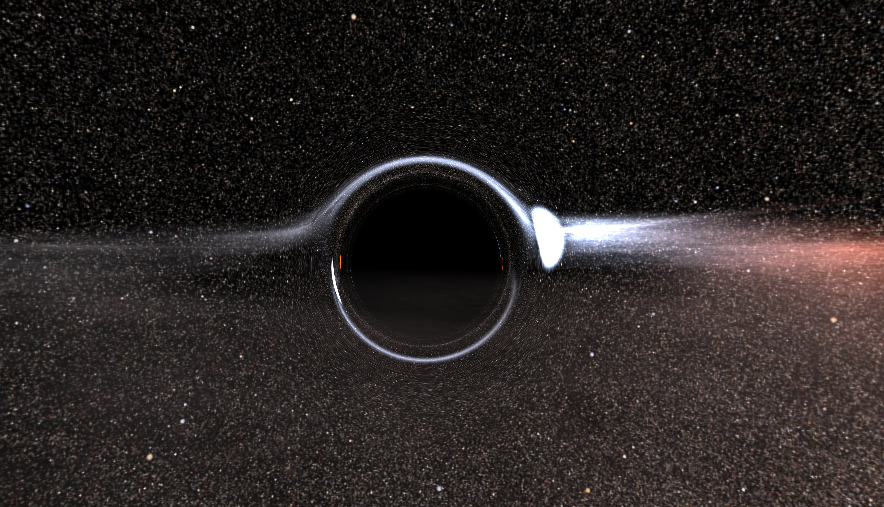
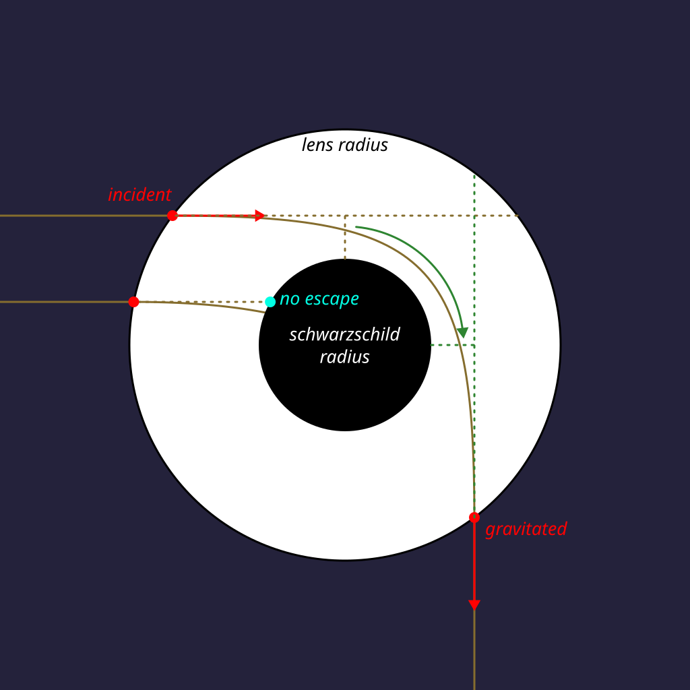
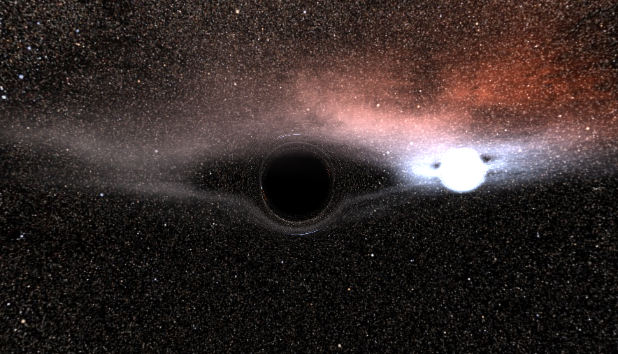
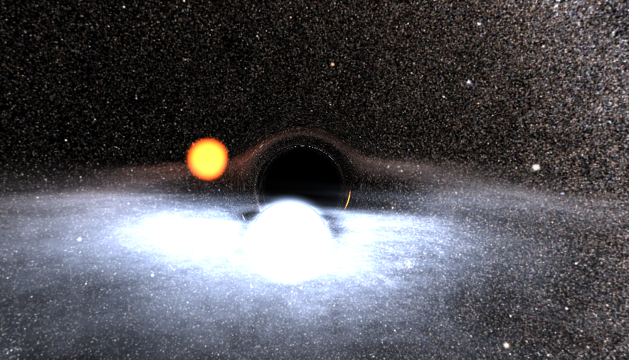
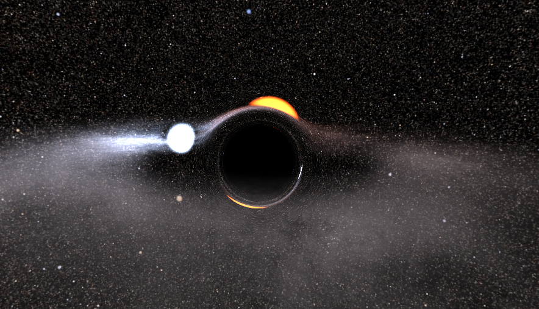
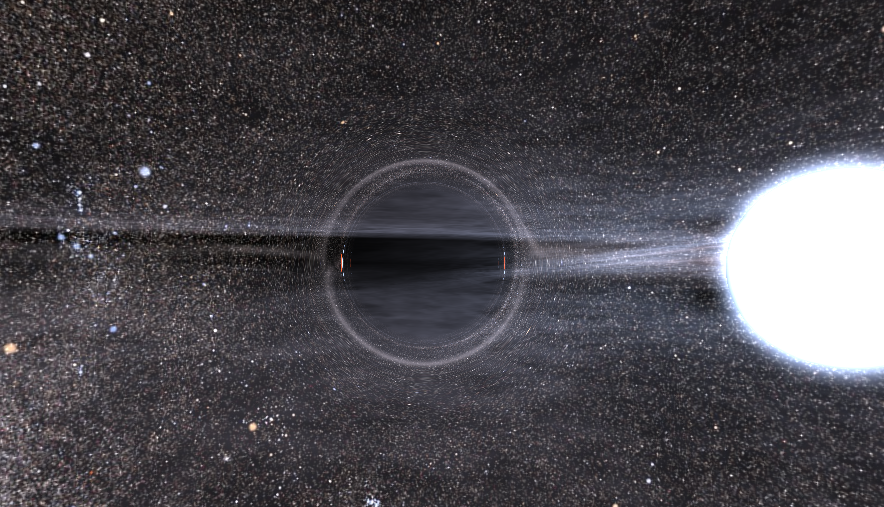
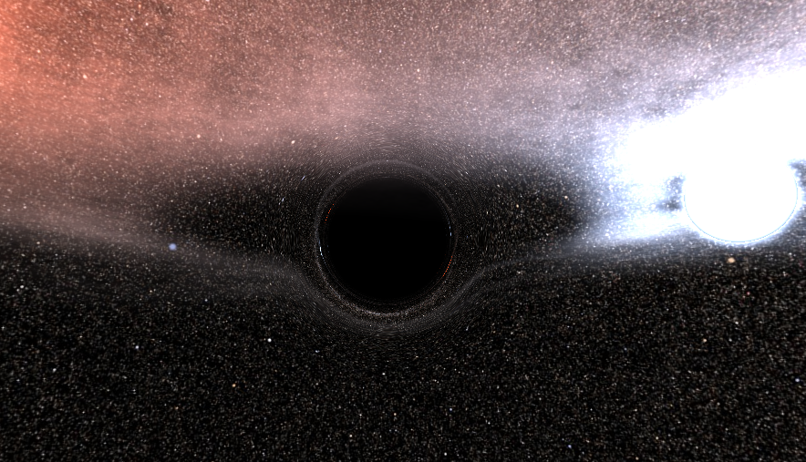

# GRAVITY

(scroll down for usage instructions, if you don't care about my interest in black holes)

Take a sheet of aluminum foil and try to press it into a ball, and compress it as small as you can. Maybe try it using a hydraulic press. How dense did you get it? Probably not as dense as a black hole.

Black holes are the densest objects in our universe. They are so dense, that their gravitational field completely breaks space and time. The escape velocity of their field is faster than the speed of light, meaning that not even light itself can escape a black hole. We may probably never discover what's inside a black hole, as whatever we send in there is never to be seen again.

Albert Einstein predicted black holes in his theory of general relativity. He believed they couldn't exist, he was sceptical like that. But over the years, all that scientists found was evidence that they are real. The big breakthrough came in April 2019, as the first ever photo of a black hole was taken.

But wait, if light can't escape a black hole, shouldn't that also mean that light is affected by gravity? The answer is yes: very dense objects can bend the paths of light. This is called gravitational lensing. Black holes are in fact so strong that they can make light completely orbit the black hole. This means that you'd be able to see yourself, if you were close enough to a black hole. Don't do that though, the gravity will rip you apart.

We do have some really pretty and high-resolution pictures of black holes, made by some awesome teamwork of astronomers and telescopes:



This is Saggitarius A*, a giant black hole at the center of our milky way, and we are orbiting it (at a very large and safe distance). This picture is courtesy of the Event Horizon Telescope organisation (EHT). They tried their best, their very best, but this picture doesn't show much, so let's actually approach a black hole.

Safety first! Black holes are dangerous to approach. And they are far away, so it will take us thousands of years to find one. However, we can simulate one! Real-time! How? Raytracing of course! Using a real-time raytracer, written in GLSL, we produced the following image:



What we see here is a black hole, some dust around it, and a star, which is behind the gravitational lens of the black hole. You can see the star in two places actually, on the right, and in a small stretched-out spot on the other side. You can also see it distort the background skymap and the dust.

It doesn't come close to the actual photo from EHT though, and that's for several reasons:
- The EHT photo was taken in a radio spectrum, at one frequency, and then mapped to the visible spectrum using a red-orange colour mapping.
- The black hole in the EHT photo is way more massive and it has a massive disc of matter orbiting around it, which is what emits the radio light. We are not going to simulate that much matter, so we kept it to a lighter black hole.
- This is a real-time simulation, we want to keep it real-time and stick to some fast approximations.

# Want to see it for yourself?
### If you skipped the above rant about what black holes are, this is where you should stop skipping.

You are in luck! Navigate your spaceship to the directory in which you cloned this repository, and run this one command:

```
./gradlew run
```

Or on Windows (because Windows is strange):
```
.\gradlew run
```

Once Gradle has finished doing 10 hours of building, a window will open and your personal black hole is ready to show you some cool raytracing tricks. There's nothing to interact with, but the camera and stars move so you'll get some nice angles eventually.

_**Disclaimer**: I have not tested this on OSX. The app requires to be initialised on the first thread, and the JVM on OSX tends to not do that unless a specific argument is given. Gradle should do this, but I am not sure if it works._

# But- how?!

Yes, I know you're impressed, but it's just a raytracer. Let me break down the basics down for you.

## The skymap
The boring part is the skymap, it's a texture under `src/main/resources/skymap.png`. It is mapped to a sphere of quote-on-quote "infinite" radius. Whenever the raytracer hits nothing, it will simply take the direction of that ray and map it to a point on that infinite sphere, which in turn maps to a texture. This creates the nice starry galaxy background.

## The clouds
The clouds look super fancy and almost like real clouds. Though, after a while you can probably tell they are comprised of flat discs with a fancily shaded texture. This texture is under `src/main/resources/dust.png`. These discs are illuminated by the stars, and a small fading effect is applied to fade to transparent where another object is close.

## The stars
The stars are as simple as raytracing an emissive sphere. Though, the sphere that we raytrace is slightly larger than the star itself. If we cross the inner surface of the sphere, we consider the star solid, otherwise we create a small gradient that adds to the background light, creating a nice little glow effect.

## The beast of the scene: the black hole
To simulate gravitational lensing accurately, we would have to step along the ray and consider the black hole's gravity at every single step. We did this, and it was slow. So we took another approximation.

First of all, we restricted the lensing to a sphere. Anywhere outside this sphere, the lensing would be so weak that we would barely see it, so we could just as well interpolate the lensing to 0 altogether as we get further away from the black hole.

Now we just teleport the ray through the lens, on the premise nothing intersects the lens, so whatever intersects the lens is not seen. We do this at an angle: the closer the ray would get to the black hole, the more the ray would "sweep" around the black hole, and the bigger the angle of the outging ray. This angle is inversely proportional to the squared distance.



This diagram depicts it well. We have two incident rays. One ray crosses the so-called "schwarzschild radius": the radius of no return. This is where we see black. The other ray, however, still makes a chance at escaping. The green arrow in the image indicates the angle at which we cast the outgoing ray. You can see that we cast this outgoing ray at the same offset from the black hole's center as the incident ray.

By not caring about the actual path inside the black hole's lens sphere, we have achieved a fast approximation of gravitational lensing, and it actually looks really realistic!

## Raytracing in GLSL

Doing raytracing in GLSL comes with some complications, but the biggest problem is the lack of recursion. GLSL doesn't like recursion, so we have to manually create a stack and perform the operations in a loop.

Another complication comes from the nature of GLSL: it is called for every single pixel, so we set up the scene for every single pixel. There are ways to optimize this, using uniforms, but that would require major refactoring of the codebase, so we chose not to do that.

The shader that does the raytracing is `src/main/resources/fsh.glsl`. It's the fragment shader of the one quad that goes through the OpenGL rendering pipeline. Try to read it, it's a pure spaghetti code! That's because there is nearby black hole code that sphagettifies it. Compare it to the vertex shader, `vsh.glsl`, the difference in complexity is extreme!

Since GLSL runs on the GPU, and since the scene we raytrace is relatively simple, we can do the raytracing relatively quickly. However, if you turn the window to full screen, you will for notice the drop in FPS, as it has to render about 4 times more pixels. If you have a beefy GPU it may still run pretty smoothly though.

## The framework

The framework code (that what's Kotlin) is pretty small actually! It just draws a single quad to the screen, passing most information directly into the GLSL shader through the use of uniforms. It uses 2 textures, some code is there to load those. Most of that logic is in `Renderer.kt`.

The backing framework is LWJGL, the _LightWeight Java Game Library_. See https://lwjgl.org/. It may sound like it's a game engine and that I'm cheating, but LWJGL is actually just a collection of Java bindings for various C libaries, including OpenGL. We also use GLFW for creating a window with an OpenGL context, and STB, for loading PNG files. 

Wait, Java? Yes, Kotlin runs on the JVM, and you can call any Java function from Kotlin seamlessly.

# Gallery + fun facts about black holes

Here's some more fancy screenshots:



Did you know that black holes actually decay over time? It's due to an effect called Hawking Radiation. In a vacuum, fake particles kind of just show up and disappear all the time, without being able to be measured. But black holes are so strong that they can absorb the fakeness of such particles, making them real. Since this particle will be right outside the schwarzschild radius, the particle can still escape. And as a real particle has real mass and therefore real energy, the black hole will have to lose energy, and eventually it will decay. This can take a googol years though.



To turn the earth into a black hole, we must compress its entire mass to the size of a 1 euro coin. What if we did that? Well, we'd die. But, not all of us will die immediately. The people in the ISS will survive as long as they have food, since the ISS is in orbit, and the gravitational field at that distance will not have changed.



To turn the sun into a black hole, we would need to compress it to the size of a small town. If that were to happen, we'd also die from the lack of sunlight eventually. But, if we gave that black hole enough matter to form an accretion disc (which will be unstable), it could produce enough light to keep us alive! 


Black holes are so strong that they completely reverse time and space inside of them. That's kinda very extremely odd, and we don't know what that looks like. Maybe it will rip our entire universe apart! If that's the case, it'd probably be better for a black hole to stay as it is. At the event horizon of the black hole, time completely stands still, so whatever falls into a black hole, will seem to just freeze!



Schwarzschild is German for "black shield". The Schwarzschild radius of a black hole is the radius at which nothing can escape anymore, so this is what we see as black. This black sphere is a black shield protecting the universe from whatever is inside. But why don't we just call it a "black shield radius"? That's because the Schwarzschild radius was named after Karl Schwarzschild, the guy who solved Einstein's equations to find it.



Black holes spin! The one in the simulation doesn't, but spinning black holes are intriguing. In reality, every single black hole spins, which also distorts the gravitational field. But on top of attracting with great force, spinning black holes also like to fling with great force, flinging matter outwards and making the net "force" (it's not really a force) weaker than the actual gravitational force. This allows you to cross the Schwarzschild radius of a black hole while still being able to escape! Still don't do this though, black holes like to rip things apart either way.

# Credits:
- Black hole photo: EHT
- Skymap texture: NASA
